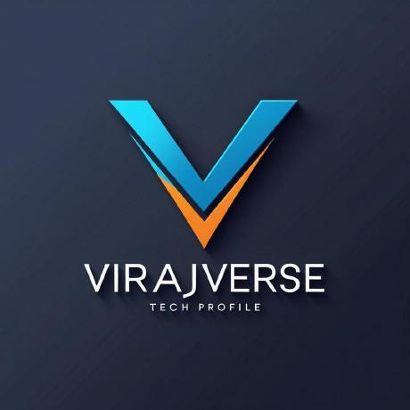

#  VirajVerse Portfolio

A premium, state-of-the-art **3D Interactive Developer Portfolio** and **Headless CMS Admin Dashboard** built for **Viraj Srivastav** — AI Systems Engineer & Full-Stack Developer.

Live Preview: [virajverseportfolio.vercel.app](https://virajverseportfolio.vercel.app)

---

## 🎨 Key Features

### 🎹 **3D Interactive Keyboard (Spline & Three.js)**
* Immersive custom-made 3D interactive keyboard viewport.
* Interactive keycaps representing core tech skills with instant visual state highlights, label popups, and description cards.
* Responsive viewport viewport bounds tracking with non-absolute rendering on mobile/tablet screens to prevent coordinates drift.

### 🕶️ **Matrix Digital Code Rain Easter Egg**
* Custom Canvas-based Matrix code rain flow overlay spanning the entire viewport.
* Interactive toggle triggers: simply click on the page and press the **`m`** key to enter/exit the matrix.
* Features beautiful Katakana, binary streams, and color-opacity trails.

### 🔐 **Server-Secured Admin Workspace**
* Fully redesigned CMS workspace dashboard for project management and incoming messages control.
* Server-side credentials validation via `/api/admin/auth` utilizing server-exclusive environment variables (`ADMIN_PASSWORD`).
* Decoupled auth checking to prevent password strings leakage inside compiled client-side JavaScript bundles.
* Secure image and screenshot uploads targeting disk storage with strict `x-admin-token` header validation checks.

### 📥 **Spam-Protected Contact Inbox**
* Real-time contact message submissions stored directly in Supabase DB via server-controlled anon bypasses.
* IP-based rate limiting (maximum 3 messages per 5 minutes per client IP) to block spammers and Denial of Service (DoS) attacks.
* Pre-configured quick response actions: direct "Reply via Email" mailto template integrations.

---

## 🛠️ Technology Stack

* **Core**: Next.js 14 (App Router, Route Groups segregation)
* **3D & Shaders**: Spline Runtime SDK, Three.js, GSAP (ScrollTrigger), Framer Motion
* **Database & Auth**: Supabase (PostgreSQL)
* **Email Delivery**: Resend SDK
* **Style Engine**: TailwindCSS, CSS Modules

---

## ⚙️ Local Development Setup

### 1. Clone the repository
```bash
git clone https://github.com/virajverse/VirajVersePortfolio.git
cd VirajVersePortfolio
```

### 2. Configure Environment Variables
Create a `.env` file in the root directory:
```env
# Admin credentials
ADMIN_PASSWORD="your-secure-admin-password"

# Supabase database config
NEXT_PUBLIC_SUPABASE_URL="https://your-project-id.supabase.co"
NEXT_PUBLIC_SUPABASE_ANON_KEY="your-anon-key"
SUPABASE_SERVICE_ROLE_KEY="your-service-role-key"

# Email Configuration
RESEND_API_KEY="re_yourkey"
```

### 3. Install Dependencies & Run
```bash
npm install
npm run dev
```
Open `http://localhost:3000` to view the site, and `http://localhost:3000/admin` to access the Admin Panel (Password: Use the value configured in `ADMIN_PASSWORD` in your `.env` file).

---

## 📈 Optimization & Build Check
To execute type-checking compile audits:
```bash
npx tsc --noEmit
```
